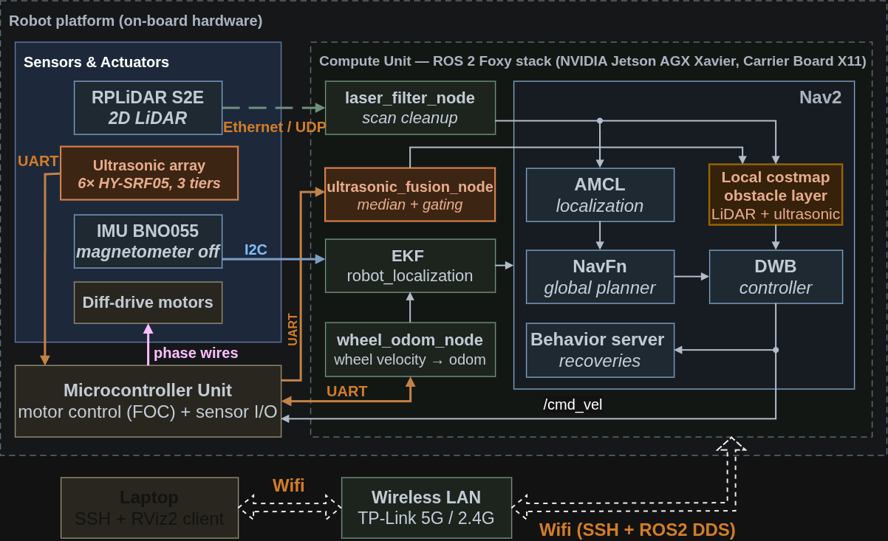
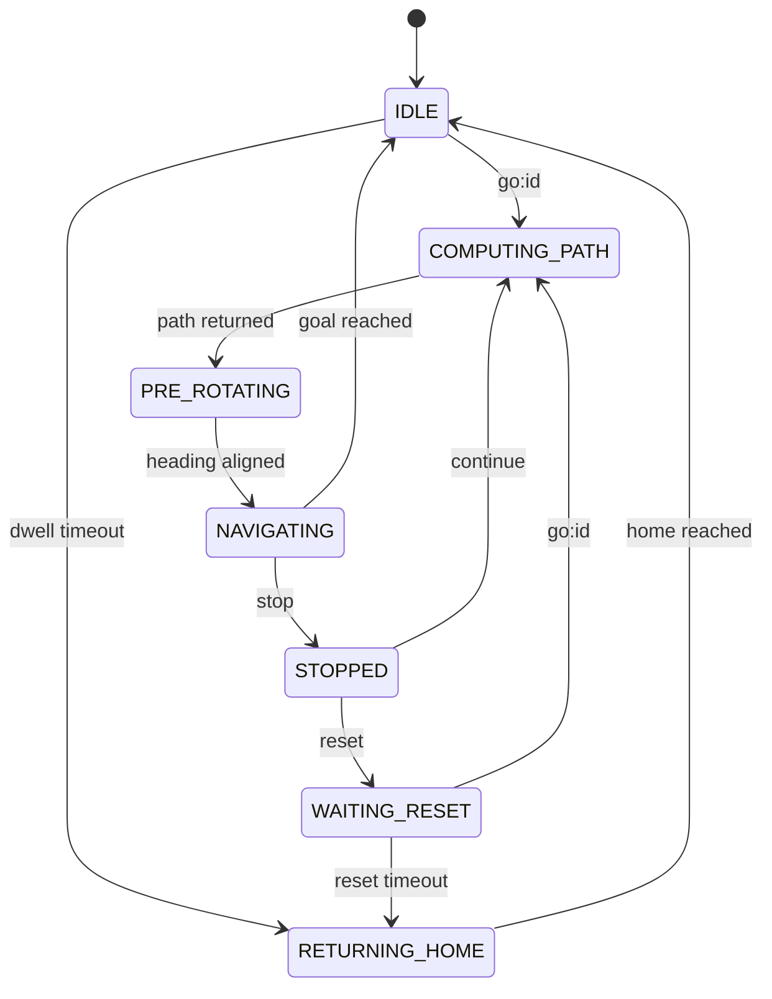

<div align="center">

# Receptionist Robot

**Checkpoint-driven indoor navigation for a differential-drive service robot — 2D LiDAR, IMU and a six-transducer ultrasonic array fused on-board a Jetson AGX Xavier under ROS 2 Foxy.**

[](https://docs.ros.org/en/foxy/)
[](https://releases.ubuntu.com/20.04/)
[](https://developer.nvidia.com/embedded/jetson-agx-xavier-developer-kit)
[](package.xml)
[](LICENSE)

</div>

## Overview

`mobile_robot` is the complete ROS 2 package for a hoverboard-chassis service robot that drives itself between named checkpoints inside a building. An operator sends `go:3` on a single topic; the robot plans, aligns its heading, drives, and returns home on a timeout. Localization, planning, control and sensor fusion all run on the robot's Jetson — the laptop is used only for RViz and SSH.

Six HY-SRF05 transducers, mounted on three heights across the front face, cover the blind zone of the single-plane LiDAR and enter the Nav2 local costmap as a second observation source.

> [!NOTE]
> This package targets one physical platform and one environment class: a differential-drive chassis with a front caster, operating indoors on flat floors.

<p align="center">
  <a href="https://www.youtube.com/shorts/xI_mEReax4k">
     
  </a>
  <br>
  <em>Click to watch the Demo video</em>
</p>

## System architecture



| Node | Package | Publishes / owns | Role |
|---|---|---|---|
| `wheel_odom_node` | `mobile_robot` | `/odom` | STM32 UART binary frames to wheel odometry; TF publishing disabled |
| `bno055` | `bno055` | `/imu/data` | BNO055 driver on I2C bus 8, remapped from `/imu/imu` |
| `sllidar_node` | `sllidar_ros2` | `/scan` | RPLIDAR S2E over Ethernet/UDP |
| `jetson_sensor_bridge` | `mobile_robot` | `/ultrasonic/*` (6) | Parses checksummed UART text frames from the ESP32 into `Range` |
| `ultrasonic_fusion_node` | `mobile_robot` | `/ultrasonic_scan` | Six `Range` messages to one synthetic 360-ray `LaserScan` |
| `scan_to_scan_filter_chain` | `laser_filters` | `/scan_filtered` | Four-stage LiDAR filter chain |
| `ekf_filter_node` | `robot_localization` | `TF odom→base_footprint` | Sole publisher of that transform |
| Nav2 bringup | `nav2_bringup` | `TF map→odom`, `/cmd_vel` | AMCL, planner, controller, recoveries, both costmaps |
| `global_localizer` | `mobile_robot` | `/global_localizer/ready` | Startup global localization: spin, then confirm AMCL convergence |
| `navigator` | `mobile_robot` | `/robot/state` | Checkpoint state machine |

Nodes start under staggered `TimerAction` delays so hardware and TF settle before Nav2 boots — Nav2 at t=12 s, `global_localizer` at t=14 s, `navigator` at t=20 s. Shortening these breaks bringup.

## Perception and navigation

Component choices only; every numeric parameter lives in the file named beside it.

| Subsystem | Choice | Configured in |
|---|---|---|
| Odometry fusion | EKF, 2D planar mode, `world_frame: odom`; velocity channels from `/odom`, yaw from `/imu/data` | `config/ekf.yaml` |
| LiDAR conditioning | Box filter, range filter, two symmetric angular-bounds filters | `config/laser_filter.yaml` |
| Ultrasonic fusion | Per-sensor median window plus a consistency gate; beams expanded over the transducer arc | `scripts/ultrasonic_fusion_node.py` |
| Localization | AMCL on `/scan_filtered`, `base_frame_id: base_footprint` | `config/nav2_params.yaml` |
| Global planner | NavFn, plugin id `GridBased` | `config/nav2_params.yaml` |
| Controller | DWB, plugin id `FollowPath`, `SimpleProgressChecker` / `SimpleGoalChecker` | `config/nav2_params.yaml` |
| Recoveries | `recoveries_server` with `wait`, `spin`, `backup` | `config/nav2_params.yaml` |
| Local costmap | `obstacle_layer` + `inflation_layer`; the obstacle layer takes **two** observation sources, `/scan_filtered` and `/ultrasonic_scan` | `config/nav2_params.yaml` |
| Global costmap | `static_layer` + `obstacle_layer` + `inflation_layer`; LiDAR only | `config/nav2_params.yaml` |
| Behavior tree | Replanning pipeline with local and global costmap clearing, wrapped in a recovery node | `behavior_trees/navigate_w_replanning_and_recovery_x221.xml` |
| Mapping | `slam_toolbox` in `online_async` mode | `config/mapper_params_online_async.yaml` |

Every node in the behavior tree sets `server_timeout="1000"` to override the 10 ms default hardcoded in Foxy's `bt_navigator`. Lowering these values causes `ComputePathToPose` to abort on large maps; do not change them.

The three ultrasonic mounting heights exist in the URDF and in physical detection only. The fused scan is planar — whichever tier sees an obstacle marks the same costmap cell, and the tier identity is not carried through.

## Checkpoint navigation

`navigator` accepts four commands on `/robot/command` (`std_msgs/String`) and reports on `/robot/state`, `/robot/current_checkpoint` and `/robot/status_message`. It publishes `/cmd_vel` only during `PRE_ROTATING`, where a P-controller aligns the robot with the initial heading of the planned path before handing off to Nav2.



States not shown as accepting `go` reject it and ask for `stop` first. Checkpoints are loaded from `config/checkpoints_<floor>.yaml`, selected by the `floor` launch argument, and paired with `maps/map_<floor>.yaml`.

## Requirements

| Hardware | Detail |
|---|---|
| Compute | Jetson AGX Xavier Developer Kit 16 GB on an [Auvidea X221](https://auvidea.eu/product/x221-70415/) carrier board |
| LiDAR | RPLIDAR S2E, Ethernet/UDP |
| IMU | BNO055 on I2C bus 8 via header J23, address `0x28` |
| Ultrasonic | 6 × HY-SRF05 read by an ESP32, forwarded over UART |
| Chassis | Hoverboard differential drive, STM32F103RCT6 running [hoverboard-firmware-hack-FOC](https://github.com/EFeru/hoverboard-firmware-hack-FOC), binary UART protocol |

The ESP32 and STM32 firmware are not part of this repository.

| Software | Version |
|---|---|
| OS | Ubuntu 20.04 |
| ROS 2 | Foxy Fitzroy |
| Build | `ament_cmake` + `ament_cmake_python`, `colcon` |
| ROS dependencies | `sllidar_ros2`, `bno055`, `robot_localization`, `laser_filters`, `slam_toolbox`, `nav2_bringup` |
| Python | `pyserial` |

Two udev symlinks must resolve before launch: `/dev/ttyWheel` (STM32) and `/dev/ttyUltrasonic` (ESP32). The LiDAR expects the Jetson to hold a static address on its subnet; see [`assets/docs/troubleshooting.md`](assets/docs/troubleshooting.md).

## Quick start

```bash
cd ~/mbrobot_ws && colcon build --packages-select mobile_robot && source install/setup.bash
./src/mobile_robot/pre_check.sh --floor e6 --skip-build   # hardware, devices, config
./src/mobile_robot/run_nav.sh --floor e6                  # bringup + bag recording
ros2 run mobile_robot checkpoint_cmd.py                   # second terminal: send go/stop/continue/reset
```

`run_nav.sh` records a bag per run into `$WS/bags/` by default; pass `--no-bag` to disable it. Set `ROS_DOMAIN_ID` and `RMW_IMPLEMENTATION` identically on the Jetson and the laptop before starting RViz.

<details>
<summary>Building a map instead of navigating</summary>

```bash
./src/mobile_robot/run_slam.sh --scenario S6 --speed 0.10 --run 01
```

`slam.launch.py` starts no teleop node — drive the robot with `teleop_twist_keyboard` or a joystick in a separate terminal. The script saves the map on exit unless `--no-save-map` is given; manual saving is covered in [`docs/mapping.md`](docs/mapping.md).

</details>

## Repository layout

```text
├── assets/                  # architecture diagram, hardware demo recording
├── behavior_trees/          # Nav2 BT with raised server_timeout values
├── config/
│   ├── bno055_params.yaml           # IMU: I2C bus, address, fusion mode
│   ├── checkpoints_<floor>.yaml     # named goal poses, loaded by navigator
│   ├── ekf.yaml                     # robot_localization sensor channels
│   ├── laser_filter.yaml            # four-stage LiDAR filter chain
│   ├── mapper_params_online_async.yaml
│   ├── nav2_params.yaml             # AMCL, planner, controller, costmaps, recoveries
│   └── wheel_odom_params.yaml       # serial port, wheel geometry
├── launch/
│   ├── nav.launch.py                # production: hardware + EKF + Nav2 + navigator
│   ├── slam.launch.py               # mapping: hardware + slam_toolbox
│   ├── view_robot.launch.py         # hardware + TF, no autonomy
│   └── view_lidar_imu.launch.py     # LiDAR and IMU only
├── docs/                    # troubleshooting and mapping guides
├── maps/                    # <floor>.pgm + .yaml pairs
├── meshes/                  # chassis mesh referenced by the URDF
├── scripts/
│   ├── wheel_odom_node.py           # STM32 UART bridge
│   ├── jetson_sensor_bridge.py      # ESP32 UART to sensor_msgs/Range
│   ├── ultrasonic_fusion_node.py    # Range array to synthetic LaserScan
│   ├── imu_reader.py                # quaternion to Euler, debug only
│   ├── global_localizer.py          # startup global localization
│   ├── navigator.py                 # checkpoint state machine
│   ├── checkpoint_cmd.py            # interactive command CLI
│   ├── BT.py                        # standalone Bluetooth-to-hoverboard bridge, non-ROS
│   └── tools/                       # calibration, profiling, bag post-processing
├── urdf/                    # xacro robot description
├── pre_check.sh             # six-phase pre-flight check
├── run_nav.sh               # navigation experiment runner
└── run_slam.sh              # mapping experiment runner
```

`scripts/BT.py` claims `/dev/ttyWheel` and `/dev/ttyUltrasonic`; it cannot run at the same time as `nav.launch.py`.

## Documentation

| Document | Contents |
|---|---|
| [`assets/docs/troubleshooting.md`](assets/docs/troubleshooting.md) | Per-subsystem bring-up checks: LiDAR link, ultrasonic bridge, IMU, wheel odometry, EKF |
| [`assets/docs/mapping.md`](assets/docs/mapping.md) | Saving a `slam_toolbox` map, including QoS and timeout settings for large maps |

## References

- [Nav2 documentation](https://navigation.ros.org/) — AMCL, NavFn, DWB, behavior trees, costmap layers
- [`slam_toolbox`](https://github.com/SteveMacenski/slam_toolbox) — online asynchronous mapping
- [`robot_localization`](https://github.com/cra-ros-pkg/robot_localization) — EKF state estimation
- [`sllidar_ros2`](https://github.com/Slamtec/sllidar_ros2) — RPLIDAR S2E driver
- [hoverboard-firmware-hack-FOC](https://github.com/EFeru/hoverboard-firmware-hack-FOC) — STM32 chassis firmware
- [Auvidea X221 manual](https://auvidea.eu/download/X221_Manual_v2.0.pdf) — carrier board pinout, including J23
- [REP-105](https://www.ros.org/reps/rep-0105.html) — the `map` → `odom` → `base_footprint` frame convention used here

## Acknowledgements

The authors thank ASIC Lab - VNUHCM University of Information Technology for providing the equipment and hardware for the robot. This research was supported by the VNUHCM University of Information Technology’s Scientific Research Support Fund.

## License

Apache-2.0. See [`LICENSE`](LICENSE).
